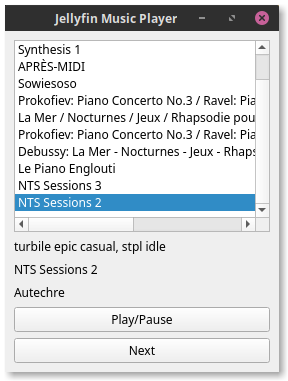

# Jellyfin Music Player

AKA jfmp, a minimalist cross-platform gapless music player for Jellyfin.



## Install from sources

### Requirements

As the wheel for music-player-core is not yet provided you have to build it yourself from sources, this is why you need these requirements:

* boost >=1.55.0
* ffmpeg >= 2.0 (including libswresample)
* portaudio >=v19
* chromaprint

#### Debian and derivatives

```bash
apt-get install python-dev libsnappy-dev libtool yasm libchromaprint-dev portaudio19-dev libboost-dev

# FFmpeg
apt-get install libavformat-dev libavresample-dev
```

# Install and build

    git clone --recurse-submodules https://github.com/n-peugnet/jfmp
    pip install --user pipenv
    pipenv install

## Run

    pipenv run ./main.py

##  Built With

-   [music-player-core](https://github.com/albertz/music-player-core)
-   [jellyfin-apiclient-python](https://github.com/iwalton3/jellyfin-apiclient-python)
