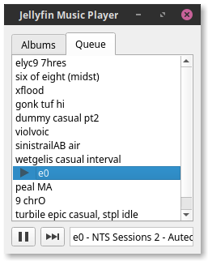

# Jellyfin Music Player

AKA jfmp, a minimalist cross-platform gapless music player for Jellyfin.



## Features/ToDo

- [x] Gapless playback
- [x] In-memory streaming + cache
- [ ] Limit cache to a maximum size (LRU ? FIFO ?)
- [ ] Lists
  - [ ] List all with lazy loading (Check Qt possibilities)
  - [ ] Songs
  - [ ] Artists
  - [ ] Sort lists (QTableWidgets ?)
  - [ ] Filter (by Artist, Album, Genre)
- [ ] Keyboard controls
  - [ ] <kbd>A-Z</kbd> : Quick jump in sorted list
  - [x] <kbd>Spacebar</kbd> : Play/Pause
  - [x] <kbd>🠆</kbd> : Next
  - [x] <kbd>Enter</kbd> : Play selected
  - [x] <kbd>Ctrl</kbd>+<kbd>Tab</kbd> : Change tab
- [ ] Search functionality
- [ ] Playback bar with seek functionality
- [ ] Queue managment
  - [ ] Reorder queue
  - [ ] Play next
  - [ ] Add to Queue
- [ ] Remote Jellyfin control
- [ ] Desktop integration (using DBUS ? Needs research)
- [ ] Packaging
  - [ ] Debian
  - [ ] Pip with Wheel dist

## Install from sources

### Requirements

As the wheel for music-player-core is not yet provided you have to build it yourself from sources, this is why you need these requirements:

* boost >=1.55.0
* ffmpeg >= 2.0 (including libswresample)
* portaudio >=v19
* chromaprint

#### Debian and derivatives

```bash
apt-get install python-dev libsnappy-dev libtool yasm libchromaprint-dev portaudio19-dev libboost-dev

# FFmpeg
apt-get install libavformat-dev libavresample-dev
```

### Install and build

    git clone https://github.com/n-peugnet/jfmp
    pip install --user pipenv
    pipenv install

_Note: if you want to use your system theme you will have to symlink your virtualenv's `PySide2` folder to your system one. It is probably located around `/usr/lib/python3/dist-packages/PySide2`._

### Run

    pipenv run ./main.py

## Built With

-   [albertz/music-player-core](https://github.com/albertz/music-player-core)
-   [iwalton3/jellyfin-apiclient-python](https://github.com/iwalton3/jellyfin-apiclient-python)
